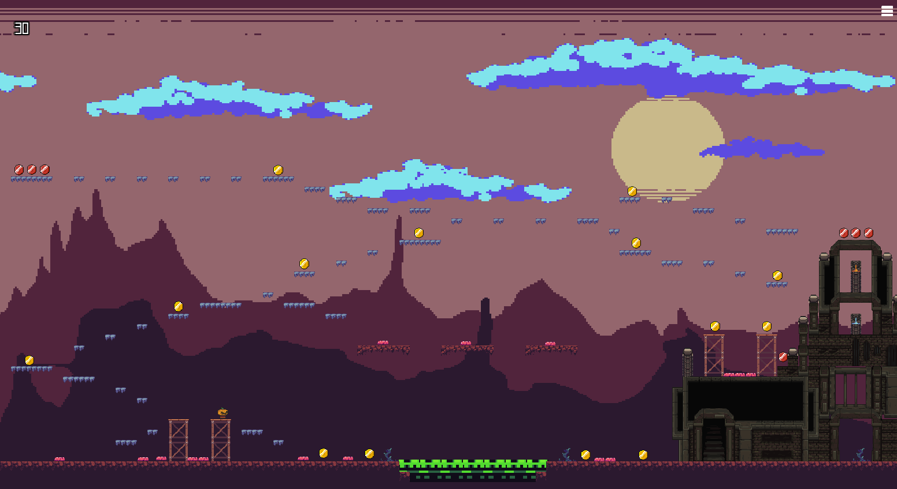
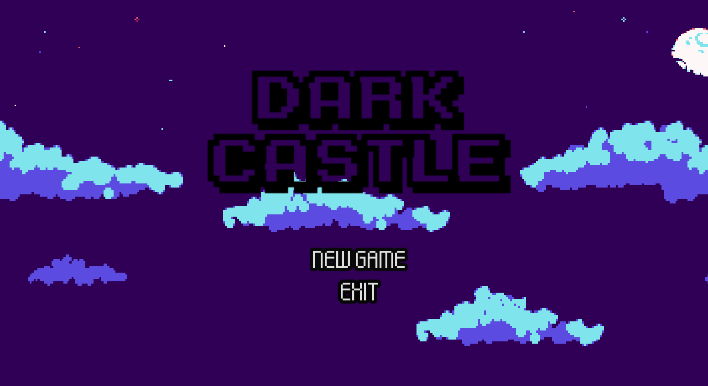

# Dark Castle

2D platformer built in Godot as a university final project. Collect every coin in the level to unlock the next one while avoiding the traps along the way.

This was my first complete game, designed and developed entirely by me.

## Play

- Web build: [itch.io link]

## Features

- Player movement with 2D physics
- Coin-based progression: all coins must be collected to advance to the next level
- Environmental traps the player has to avoid
- Multiple levels with a fixed camera showing the whole stage
- Main menu, pause menu and game over screen

## Controls

| Action | Key |
| --- | --- |
| Move | [fill in] |
| Jump | [fill in] |
| Pause | [fill in] |

## Screenshots

## Built with

- Godot Engine [version]
- GDScript

## Run locally

1. Install Godot [version].
2. Clone this repository.
3. Open Godot, choose **Import**, and select the `project.godot` file.
4. Press **F5** to run the game.

## Author

Matheo Poma Dávila — [LinkedIn](https://www.linkedin.com/in/[your-profile])
